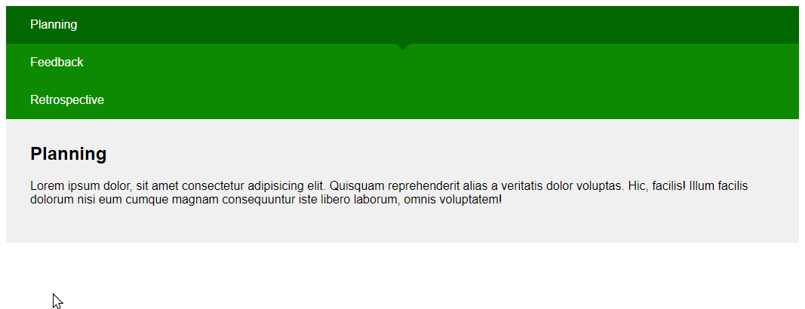

# An introduction to accessibility
## And how to create simple accessible components in React / Vue

Talk at [alsacréations](https://alsacreations.com/) about accessibility within React and Vue (and little tips).

## [You can see the slides here](https://slides.com/keziahmoselle/an-introduction-to-accessibility-in-react-and-vue#/)

## Menu

## Tabs

